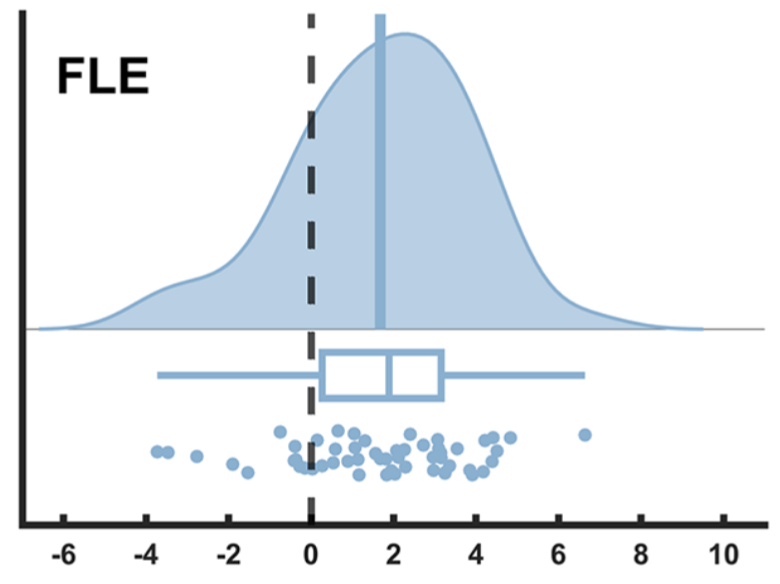

```{r setup, include=FALSE}
knitr::opts_chunk$set(echo = TRUE)
```

## 

Can’t test against a constant in quid .

Easiest thing:

Compare unconstrainted model to the dominance model , which is that each individual has a positive.

But to do that, still can't use their library because it's set up for two conditions.

The way Haaf and Rouder define it, the hypothesis is about the sample not the population. Not important for the direction we are going in.

The standardized effect size of the FLE , the average relative to residuals (measurement error or between-session variance).  In the model will go a point estimate and a prior on the between-session variance distribution, assuming some could be negative (the unconstrained model).


```{r cars}
#install.packages("R.matlab")
#install.packages("quid") 
library(R.matlab)
library(quid) ##Haaf Rouder qualitative difference package
library(tidyverse)
```
## Show how it works with the built-in Stroop example, from the vignette:

The data set contains three columns of interest for our analysis: rtS is the dependent variable, which is the response time in seconds; ID is the participant ID; and cond, a factor with two levels indicating the condition (1 = congruent, 2 = incongruent). This study is a repeated measures design, and all participants completed several trials in both conditions.

```{r stroopy, echo=FALSE}

data(stroop)

#resStroop <- constraintBF(formula = rtS ~ ID + cond + ID:cond,
#                          data = stroop,
#                          whichRandom = "ID",
#                          ID = "ID",
#                          whichConstraint = c("cond" = "2 > 1"),
#                          rscaleEffects = c("ID" = 1, "cond" = 1/6, "ID:cond" = 1/10))

```

The data set contains three columns of interest for our analysis: rtS is the dependent variable, which is the response time in seconds; ID is the participant ID; and cond, a factor with two levels indicating the condition (1 = congruent, 2 = incongruent). This study is a repeated measures design, and all participants completed several trials in both conditions.


## Load our data


```{r readData, echo=FALSE}

FLE<- readMat("FLE_Values(JOV).mat")

overallOfBothSessions<- FLE$FLE.Overall
overallOfBothSessions<- as_tibble(overallOfBothSessions)

sess1JoV<-  as_tibble(FLE$FLE.Sess1)
sess2JoV<-  as_tibble(FLE$FLE.Sess2)

```


Give data better column names

Each has three columns: participant number, Column 2 is pixels column 3 is dva

```{r , echo=FALSE}

sess1JoV <- sess1JoV %>%
  rename(
    ID     = V1,
    pixels = V2,
    dva    = V3
  )

sess2JoV <- sess2JoV %>%
  rename(
    ID     = V1,
    pixels = V2,
    dva    = V3
  )


```


Need to re-arrange the data so that session number is a column (make session long rather than wide)

ID is the participant ID; and cond, a factor with two levels indicating the condition (1 = congruent, 2 = incongruent)

```{r , echo=F}
sess1JoV$session <- 1
sess2JoV$session <- 2

myOverallJoV<- rbind(sess1JoV, sess2JoV)
```


```{r , echo=FALSE}
library(ggplot2)

ggplot(myOverallJoV, aes(x=dva)) + geom_histogram() +
  facet_grid(rows=vars(session)) +
  xlab('FLE size (dva)') +
  ggtitle('JoV2022 FLE') 

# ggplot(overallOfBothSessions, aes(x=)) + geom_histogram() +
#   xlab('FLE size (dva)') +
#   ggtitle('JoV2022 FLE') 
```
## Reproduce scatterplot of s1 and s2

```{r }

wide <- myOverallJoV %>%
  select(ID, dva, session) %>%
  pivot_wider(
    names_from = session,
    values_from = dva,
    names_prefix = "dva_"
  )

s1s2scatter<- ggplot(wide, aes(x = dva_1, y = dva_2)) +
  geom_point() +
  labs(
    x = "Session 1 dva",
    y = "Session 2 dva"
  ) +
  geom_vline(xintercept = 0, linetype = "dashed") +
  geom_hline(yintercept = 0, linetype = "dashed") +
  ggtitle("JoV FLE")
  #geom_abline() #reveals reduction from S1 to S2, consitent with practice triggering faster sampling of position
  

show(s1s2scatter)
```

```{r }
#install.packages('ggExtra')
library(ggExtra)

ggMarginal(s1s2scatter, type = "histogram")
    
```


#European Journal of Neuroscience 2025 paper

This pic includes participants that were also in JoV

```{r, out.width="80%", fig.align="center", fig.cap="My caption"}

```

Load
EJN-specific participants, from https://osf.io/jxeu3

Link: https://osf.io/jxeu3/files/2x8pg 
File is: single_sess.csv 

```{r}
#Participants who weren't also in JOV dataset 
EJNonlyParticipants <- read_csv("Single_Sess(EJN2025).csv")

na_count <- sum(is.na(EJNonlyParticipants$FLE))
cat("Number of NAs in FLE:", na_count, "\n")

print("Tim: I think the nans are because their staircases did not converge and we excluded them")
print("But i think this is where reanalysing the data later on, we could be more liberal maybe? Alex: I think we should do both")

EJNonlyParticipants <- EJNonlyParticipants %>%
  drop_na(FLE)
```

Plot histogram of EJN only Ss

```{r}

mean_val <- mean(EJNonlyParticipants$FLE)
sd_val <- sd(EJNonlyParticipants$FLE)

# Create histogram with text
ggplot(EJNonlyParticipants, aes(x = FLE)) +
  geom_histogram(bins = 30, fill = "steelblue", color = "black") +
  annotate("text", x = Inf, y = Inf, 
           label = paste0("Mean = ", round(mean_val, 2), "\n",
                         "SD = ", round(sd_val, 2), "\n",
                         "σ^2 = ", round(sd_val*sd_val, 2)),
           hjust = 1.1, vjust = 1.1, size = 5) +
  labs(title = "EJN2025-specific participants FLE", x = "FLE (dva)", y = "Count") +
  theme_minimal()

```
To decide on a prior for true score population mean
and inter-individual variance, 
```{r}

sampleMean<- mean(EJNonlyParticipants$FLE)
sampleSD<-  sd(EJNonlyParticipants$FLE)
sampleMean
sampleSD
```

